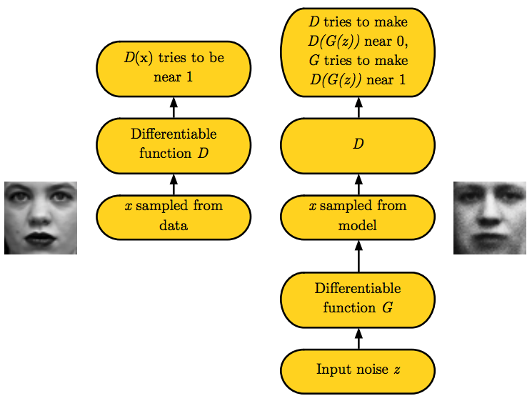
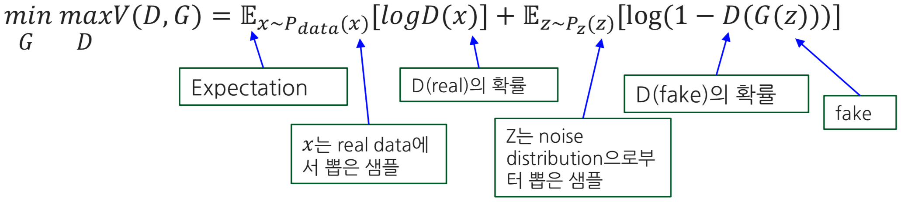
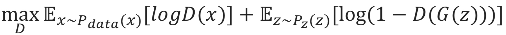
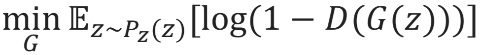
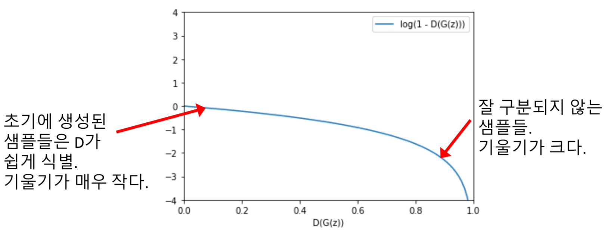
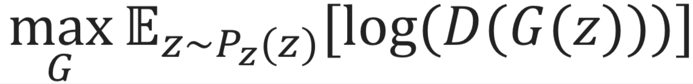
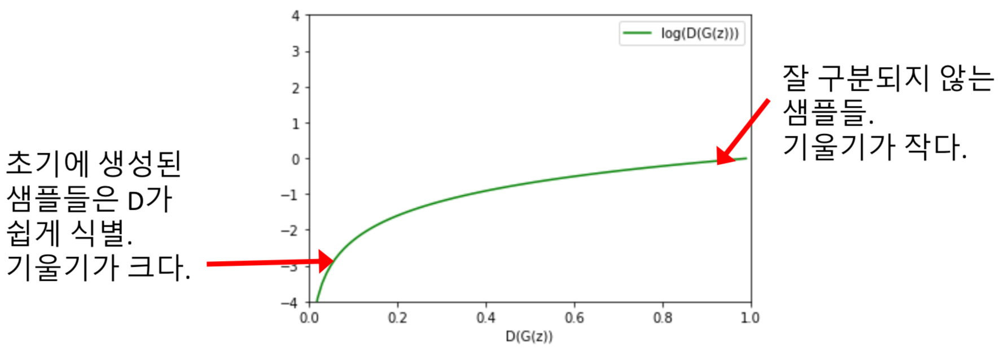
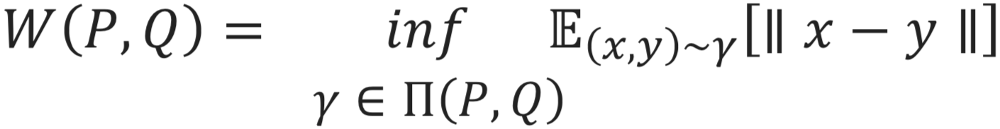
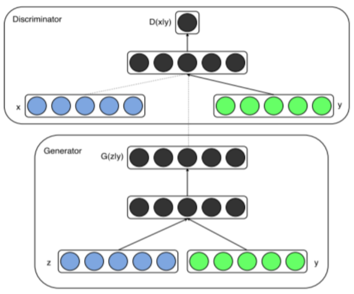
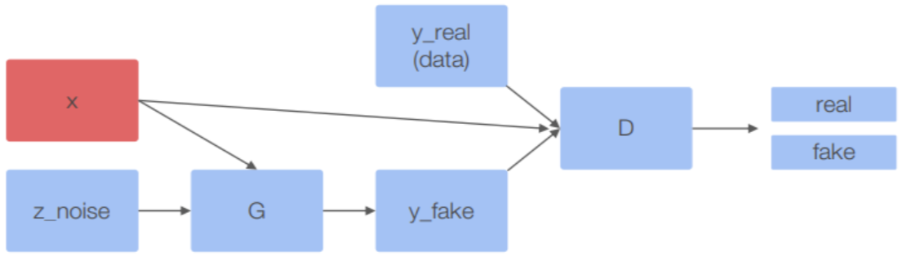

# GAN (2)

### 학습목표

1. GAN 의 목적함수 및 학습과정을 이해한다.
2. WGAN 의 장점과 개념을 이해한다.
3. Conditional GAN 을 이해하고, 활용할 수 있다.

### 1. GAN 목적함수 (cost function)

</img>

- Generator $G$
> random noise $z$ 를 입력받아 새로운 sample $G(z)$ 를 생성
>
> $D$ 가 $G$ 가 만든 이미지와 실제 이미지를 구별하지 못하도록 학습
>
> - $D(G(z)) \rightarrow 1$ (fake to real)

- Discriminator $D$
> training sample $x$ 와 generated sample $G(z)$ 를 받아, input 이 real (1) 인지 fake (0) 인지 판별
>
> 가짜를 확실하게 구별할수 있도록 학습
>
> - $D(G(z)) \rightarrow 0$ (fake to fake)
>
> - $D(x) \rightarrow 1$ (real to real)

#### Loss function

</img>

- $E_{x \sim P_{data}(x)}[logD(x)]$

    - $D$ 가 training (real) sample $x$ 을 진짜라고 판단할수 있는 능력
    
    
- $E_{x \sim P_{z}(z)}[log(1 - D(G(z))]$

    - $D$ 가 $G$ 가 만든 generated sample $G(z)$ 을 가짜라고 판단할수 있는 능력

#### Loss function (2)

> 학습자체는 둘이 한꺼번에 하지 않고 번갈아하는 방식 (하나를 학습시킬때 나머지 하나는 고정)

 

**[Discriminator]**

</img>

- 가짜와 진짜에 대한 구별을 잘할수 있도록 $\rightarrow$ **Maximize**

- $D(x)$ 는 training (**real**) sample 에 대한 판단 $\rightarrow$ 가능한한 **1** 에 가깝게

    - $D(x)$ 는 확률이므로 범위가 $0 \le D(x) \le 1$
    
    - 따라서 $[logD(x)]$ 는 $D(x)$ 가 1 일때 최대 (max)

- $D(G(z))$ 는 generated (**fake**) sample 에 대한 판단 $\rightarrow$ 가능한한 **0** 에 가깝게

    - $D(G(z))$ 또한 확률이므로 범위가 $0 \le D(G(z)) \le 1$ $\rightarrow$ $0 \le (1 - D(G(z))) \le 1$
    
    - 따라서 $[log(1 - D(G(z)))]$ 는 $D(G(z))$ 가 0 에 가까울때, 즉, $(1 - D(G(z)))$ 가 1 에 가까울때 최대 (max)
    

- Gradient Ascent (경사 상승법) 활용
 

**[Generator]**

</img>

- $D$ 를 속일수 있을 정도로 진짜같은 가짜를 만들어낼수 있도록 $\rightarrow$ **Minimize**

- $D(G(z))$ 는 generated (**fake**) sample 에 대한 판단 $\rightarrow$ 가능한한 **1** 에 가깝게

    - $[log(1 - D(G(z)))]$ 는 $D(G(z))$ 가 1 에 가까울때, 즉, $(1 - D(G(z)))$ 가 0 에 가까울때 최소 (min)
    

- Gradient Descent (경사 하강법) 활용

- Generator의 경우 위의 Cost function 을 Gradient Descent 를 사용하여 학습하면 학습이 잘 진행되지 않는 문제가 있다?

#### Existing Cost function for Generator $G$

- Generator는 $[log(1 - D(G(z)))]$ 를 최소화 하는 방향으로 학습을 진행해야 하지만 실제로는 학습이 잘 되지 않음

- 학습의 초기에는 Generator가 진짜같은 가짜이미지를 만들어낼 능력이 부족해서, Discriminator가 쉽게 가짜를 구별해냄
    - **gradient (derivitive) 값이 작기** 때문에 **학습이 매우 더디게 진행**됨

- Gradient **Descent**

</img>

#### New Cost function for Generator $G$

> </img>

- $[log(D(G(z)))]$ 를 **최대화**하는 방향으로 학습 방법을 변경

- 초기에 큰 gradient가 확보 되면서 학습이 제대로 되지 않는 문제를 해결

- Gradient **Ascent**

</img>

#### Training GAN

- Epochs 만큼 반복 :

    - Discriminator $D$ 학습
    
        - K 번만큼 반복 :
        
            - M 개의 노이즈 샘플 생성 (mini-batch size)
        
            - M 개의 샘플 선택
        
            - Network 통과시키고 경사 상승법으로 Discriminator 업데이트
            
            (training $x$ M 개 $+$ generated $G(z)$ M 개 $\rightarrow$ total 2M 개 input)

    - Generator $G$ 학습

        - M 개의 노이즈 샘플 생성

        - Network 통과시키고 경사 상승법으로 Generator 업데이트
        
        (generated $G(z)$ M 개 input)

> ---
> **[주의점]**
>
> - **기존 Network 와의 차이점**
>
>    - Network 를 하나만 학습하는 기존 learning 방식은 Cost function 이 convex function 형태로 학습
>
>    - 결과적으로 local minimun 또는 궁극적으로 global minimum 으로 수렴 (수학적으로 증명됨)
>
>    - 그러나 두개의 Network 가 경쟁하는 GAN 은 그것과는 좀 다름
>
>    - 기존 Network 는 학습종료를 결정하는데 있어서 여러가지 기준 (accuracy 등) 을 가지고 있지만, GAN 은 아직 확실한 수학적인 기준이 없음
>
>        - 간단히 $D$ 의 accuracy 가 0.5 가 됬을때 종료하는 것으로는 부족
>
>        - 사람이 직접 결과물을 보고 판단해야함
>
> ---
>
> - 논문에서는 **2 개의 망을 번갈아 가며 학습**시키는 방법을 권장. **($D : G = K : 1$ 비율로 학습)**
>
>    - 먼저 G를 고정시킨 상태에서, **K**-step 만큼 $D$ 를 학습
>
>        - Discriminator 를 먼저 학습시켜서 똑똑하게 만들면, Generator 의 학습이 더 잘된다는 가설이 있으나 아직 근거는 없음
>
>        - K값에 따라 학습 안정성이 달라져서 의견이 많음 $\rightarrow$ 정답은 없으므로 heuristic srearch (trial and error) 을 통해 여러 방면으로 시도해볼것
>       
>        - 논문의 저자는 **K 를 1** 로 두고 $D$ 와 $G$ 를 같은 비율로 학습시키는 것을 권장
>
>    - 다음 $D$ 를 고정시킨 상태에서 $G$ 를 **1**-step 만큼 학습 
>
>    - 이 과정을 내쉬 균형(Nash equilibrium) 상태에 이를때까지 반복
>
>        - Minimax 에서 두 Network 가 평형 이루는 시점
>
>        - 아직까지는 '두 Network 가 결과적으로 평형을 이룬다' 는 것에 대한 수학적 근거가 없음
>
>
> - WGAN 은 K 값에 관계없이, 상대적으로 안정성이 높아서 자주 활용됨
>
> - 실제로는 $G$ 가 진짜같은 데이터를 잘 만들어 냈는지 자동으로 판단할수 있는 방법이 별로 없기 때문에 학습종료시 사람의 개입이 필요
> ---

### 2. WGAN (Wasserstein GAN)

#### 확률 분포의 유사도 측정방식

- 분포의 유사도를 측정하는 지표에는 Generative Model 에 많이 쓰이는 KL-Divergence 등 여러가지가 존재
> </img>
>
> $N(\mu_{1}, \sigma^{2}) \leftrightarrow N(\mu_{2}, \sigma^{2})$ 간의 거리

- WGAN 은 그중에서 ***Wasserstein Distance*** 를 GAN 에 적용한 모델

#### Wasserstein Distance

- 흙을 옮길때 삽을 몇번 떠야 모든 흙을 옮길수 있는지, 그 횟수를 거리로 표현한것

- Earth-Mover Distance 라고도 불림

- 수식
> </img>
> - $P, Q$: 두 확률분포
>
> - $\gamma (x,y)$: 전체 옮길 흙의 양
>
> - $|| x - y ||$: 전체 이동 거리

- 설명
> 특정 확률분포 모양의 흙더미를 다른 위치에 있는 분포 모양으로 옮길때 필요한 최소한의 흙더미 양

#### Wasserstein Distance

> </img>
> - P: 윗쪽 노란색 분포
>
> - Q: 아랫쪽 초록색 분포
>
> - Wasserstein Distance $W(P, Q)$: P 를 Q 와 똑같이 만드는데 옮겨야하는 블록의 양과 이동거리

**이동량을 최소로 줄이면서 두 분포를 같게 만들려면...**

- Step[1] : P1 과 Q1 을 비교해서 둘이 같아지도록, P1 에서 P2 로 **2**칸 이동 

- Step[2] : P2 와 Q2 를 비교해서, P2 에서 P3 로 **2**칸 이동

- Step[3] : P3 와 Q3 를 비교해서, Q3 에서 Q4 로 **1**칸 이동

**결과**

- 총 **5**칸 만큼 이동

- 가중치를 1 이라고 가정할때, Wasserstein Distance 는 **5**
> $W(P,Q) = 5 \times 1 = 5$

- Wasserstein Distance 를 사용하면 다른 기준을 사용해서 분포의 유사도를 측정했을 때보다, 두 분포의 차이에 상관없이 일반적으로 안정적인 미분값을 보여주는 특성이 있어서 GAN 학습이 안정적으로 이루어짐

(ref)
1. [Wasserstein 거리: WGAN 수식 정리 및 증명](https://rosinality.github.io/2017/04/wasserstein-%EA%B1%B0%EB%A6%AC/)
2. [WGAN 수식 설명](https://github.com/yjucho1/articles/blob/master/fromGANtoWGAN/readme.md)

### 3. Conditional GAN

- GAN 을 이용하면 실제 존재하는 이미지와 똑같은 이미지를 생성가능

- 그러나 이미지가 어떤 특성을 갖도록 할지는 만들때 제어할 수가 없었음

- ***Conditional GAN*** 은 GAN 을 학습할때 추가적으로 **제약조건**을 부여하여 원하는 특성을 가진 이미지를 생성할수 있도록 함

#### Conditional GAN 구조 (1)

</img>
> random noise $z$, training sample $x$ 는 기존의 GAN 과 같음
>
> **새로운 조건 y (vector) 가 입력에 추가됨**
>
> - Generator $G$ : $G(z) \rightarrow G(z|y)$
>
> - Disriminator $D$ : $x \rightarrow x|y$

#### Conditional GAN 구조 (2)

</img>
> 같은 conditional vector $x$ 를 Generator ($+$ random noise $z$) 와 Discriminator ($+$ training sample $x$) 에 input
> 
> 결국 각 모델은 **condition 에 의존**한 이미지 생성 및 판별을 수행

### Condtional GAN 결과

- **conditional vector y = [0,1,2,3,4,5,6,7,8,9] 를 추가로 입력했을때**

    - condition 에 맞춰서 다른 이미지가 출력됨

</img>

---

### References

1. [Multiple Comparison (사후검정): Duncan's LSR](http://rfriend.tistory.com/archive/201510)
    
2. [From GAN to WGAN: Detaild explanation](https://lilianweng.github.io)
    
3. [Martin Arjovsky, Soumith Chintala, and LéonBottou. “Wasserstein GAN.” arXiv preprint arXiv:1701.07875 (2017)](https://arxiv.org/pdf/1701.07875.pdf)

4. [Mehdi Mizra and Simon Osindero, “Conditional Generative Adversarial Nets.” arXiv preprint arXiv:1411.01784 (2014)](https://arxiv.org/pdf/1701.07875.pdf)
    
5. [Deep Learning for Computer Vision: Generative models and adversarial training (UPC 2016)](https://www.slideshare.net/xavigiro/deep-learning-for-computer-vision-generative-models-and-adversarial-training-upc-2016/)
    
6. [[GAN] GAN이 풀어야 할 과제들](http://dl-ai.blogspot.com/2017/08/?m=0)
